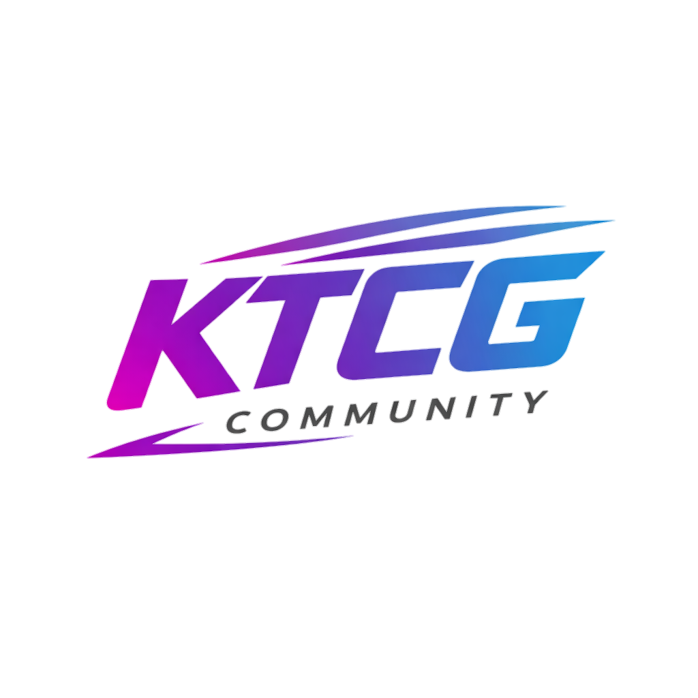
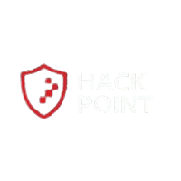

# 🚩 Beginner CTF 2026 — KTCG Community x HackPoint

<div align="center">


&nbsp;&nbsp;&nbsp;


<br><br>


### 🔐 Arsip Soal & Challenge Resmi Event Beginner CTF 2026

Diselenggarakan oleh **KTCG Community** berkolaborasi dengan **HackPoint**

</div>

---

# 📖 Tentang Event

**Beginner CTF 2026** adalah kompetisi Capture The Flag (CTF) yang dirancang khusus untuk pemula yang ingin belajar dunia cybersecurity melalui challenge interaktif dan praktikal.

Event ini menghadirkan berbagai kategori challenge mulai dari:

- Web Exploitation
- BlockChain
- Cryptography
- Reverse Engineering
- Forensics
- PWN
- OSINT
- Miscellaneous

Repository ini berisi arsip soal, file challenge, dan beberapa resource pendukung dari event yang telah selesai diselenggarakan.

---

# 🏆 Informasi Event

| Informasi | Detail |
|---|---|
| Event | Beginner CTF 2026 |
| Organizer | KTCG Community x HackPoint |
| Format | Jeopardy Style CTF |
| Status | Finished |
| Target Peserta | Beginner / Intermediate |
| Platform | Online |

---

# 📂 Struktur Repository

```bash
.
├── BlockChain/
├── Cryptography/
├── Forensics/
├── MISC/
├── OSINT/
├── PWN/
├── Public/
├── Reverse Engineering/
├── Spesial/
├── Web Exploitation/
└── README.md
```

---

# 🤝 Community

<div align="center">

### KTCG Community
[](https://discord.gg/Q5dVVBs6xX)

### HackPoint
[](https://discord.gg/fF6zXh4zrp)

</div>

---

# ⚠️ Disclaimer

Seluruh challenge dalam repository ini dibuat hanya untuk tujuan edukasi dan pembelajaran.

Dilarang menggunakan teknik yang dipelajari untuk aktivitas ilegal atau merugikan pihak lain.

---

# ❤️ Credits

Special thanks to:

- KTCG Community
- HackPoint
- Semua author challenge
- Semua peserta yang ikut meramaikan event

---

<div align="center">

### ⭐ Terima kasih telah mengikuti Beginner CTF 2026!

_"Learn. Hack. Share."_

</div>